# Path of Exile 2 Data Converter - Datenfluss-Dokumentation

Diese Dokumentation beschreibt den kompletten Datenfluss des PoE2 Data Converters von den Eingabedateien bis zur JSON-Ausgabe.

## Übersicht: Haupt-Workflow

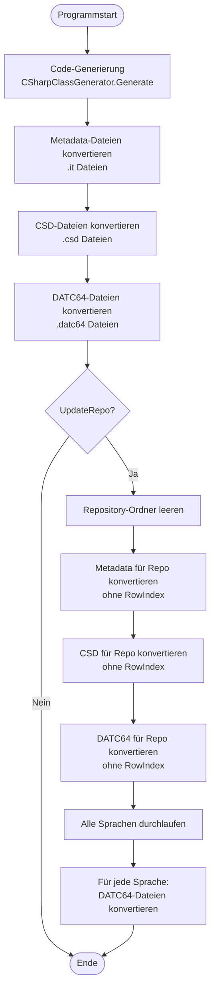

## Quelldaten: Verzeichnisstruktur und Dateiarten

### ⚠️ Wichtig: Bundle-Extraktion erforderlich

Die Spieldaten von Path of Exile 2 liegen **nicht direkt lesbar** vor, sondern sind in **komprimierten Bundle-Archiven** (.bundle.bin) gespeichert.

**Detaillierte Anleitung zur Extraktion:** Siehe [docs/EXTRACTION.md](EXTRACTION.md).

**Nach erfolgreicher Extraktion liegt folgende Struktur vor:**

```text
ExtractedFilesPath/
├── metadata/
│   ├── items/**/*.it         # Item Templates
│   ├── *.csd                 # Client String Descriptions
│   └── ...
└── data/
    ├── *.datc64              # Haupt-Tabellen
    ├── English/*.datc64      # Sprachspezifisch
    ├── German/*.datc64
    └── ...
```

### Konfigurierte Pfade (internal/config/config.go)

Das Projekt verwendet konfigurierbare Pfade:

```go
ExtractedFilesPath   = "./extracted"          // Eingabe: Extrahierte Spieldateien
// ... weitere Pfade
```

### Detaillierte Eingabe-Verzeichnisstruktur

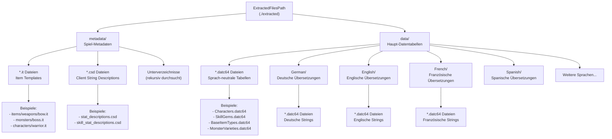

### Konkrete Dateibeispiele nach Typ

#### 1. Metadata-Dateien (.it)

**Speicherort:** `ExtractedFilesPath/metadata/**/*.it` (rekursiv)

**Charakteristik:**

- Textformat mit Key-Value-Paaren
- Vererbungshierarchie via `extends`
- Verschachtelte Strukturen mit `{ }` Blöcken

**Beispiel-Pfade:**

```text
metadata/items/weapons/bows/bow_base.it
metadata/monsters/act1/zombie.it
metadata/characters/warrior.it
metadata/terrains/acts/act1_town.it
```

**Beispiel-Inhalt:**

```text
extends "metadata/items/weapons/weapon_base"

base_item_type = "Bow"
{
    range = 120
    attack_speed = 1.5
}
```

**Verarbeitung:**

- Alle `.it` Dateien werden rekursiv gefunden: `Directory.GetFiles(..., "*.it", SearchOption.AllDirectories)`
- Von `MetadataParser.Parse()` geparst
- Vererbung wird durch `MetadataParser.Merge()` aufgelöst
- Ausgabe: `DataOutputPath/xt/` und `RepoDataOutputPath/xt/`

#### 2. CSD-Dateien (.csd)

**Speicherort:** `ExtractedFilesPath/metadata/**/*.csd` (rekursiv)

**Charakteristik:**

- Unicode-Textformat
- Beschreibungen für Stat-IDs
- Operator-basierte Formatierung
- Parameter mit Werten

**Beispiel-Pfade:**

```text
metadata/stat_descriptions.csd
metadata/skill_stat_descriptions.csd
metadata/passive_skill_stat_descriptions.csd
```

**Beispiel-Inhalt:**

```text
description
2 increased_damage fire_damage
3
+ "Erhöht Feuerschaden um {0}%" canonical_line 0 1
+ "Adds {0} to {1} Fire Damage" 0 2
# "Feuerschaden um {0}% erhöht" 0 1

no_description some_internal_stat
```

**Verarbeitung:**

- Alle `.csd` Dateien werden rekursiv gefunden
- Von `CsdParser.Parse()` geparst (Unicode Encoding)
- IDs, Descriptions, Operators und Parameter werden extrahiert
- Ausgabe: `DataOutputPath/csd/` und `RepoDataOutputPath/csd/`

#### 3. DATC64-Dateien (Haupt-Tabellen)

**Speicherort:** `ExtractedFilesPath/data/*.datc64` (nur Top-Level)

**Charakteristik:**

- Binärformat
- Sprach-neutrale Spielmechanik-Daten
- Feste Zeilen-Struktur + variable Datensektion
- Enthält numerische IDs, Flags, Referenzen

**Beispiel-Dateien:**

```text
Characters.datc64              # Charakter-Klassen (Warrior, Ranger, etc.)
SkillGems.datc64              # Skill-Gems und ihre Eigenschaften
BaseItemTypes.datc64          # Basis-Item-Definitionen
MonsterVarieties.datc64       # Monster-Typen und Stats
WorldAreas.datc64             # Zonen und Gebiete
PassiveSkills.datc64          # Passiv-Skill-Baum
Mods.datc64                   # Item-Modifikatoren
Stats.datc64                  # Stat-Definitionen
AscendancyClasses.datc64      # Ascendancy-Klassen
ChanceableItemClasses.datc64  # Chance-bare Items
```

**Verarbeitung:**

- Nur Top-Level-Dateien: `Directory.GetFiles(dataFilesPath, "*.datc64", SearchOption.TopDirectoryOnly)`
- Von `ReaderFactory.GetReader()` und `DatReader.Read()` geparst
- Memory-Marshal zu C# Structs
- Parallele Serialisierung mit `DatStructSerializer`
- Ausgabe: `DataOutputPath/data/` und `RepoDataOutputPath/data/`

#### 4. DATC64-Dateien (Sprachspezifisch)

**Speicherort:** `ExtractedFilesPath/data/{language}/*.datc64`

**Charakteristik:**

- Gleiche Binärstruktur wie Haupt-Tabellen
- Enthalten übersetzte Strings
- Gleiche Tabellen-Namen wie Hauptdaten
- RowIndex korrespondiert zu Hauptdaten

**Sprach-Ordner:**

```text
data/English/      # Englische Übersetzungen
data/German/       # Deutsche Übersetzungen
data/French/       # Französische Übersetzungen
data/Spanish/      # Spanische Übersetzungen
data/Portuguese/   # Portugiesische Übersetzungen
data/Russian/      # Russische Übersetzungen
data/Thai/         # Thailändische Übersetzungen
data/Japanese/     # Japanische Übersetzungen
data/Korean/       # Koreanische Übersetzungen
data/SimplifiedChinese/   # Vereinfachtes Chinesisch
data/TraditionalChinese/  # Traditionelles Chinesisch
```

**Beispiel-Dateien pro Sprache:**

```text
data/English/Characters.datc64        # Charakter-Namen in Englisch
data/German/Characters.datc64         # Charakter-Namen in Deutsch
data/English/SkillGems.datc64        # Skill-Namen/-Beschreibungen (EN)
data/German/SkillGems.datc64         # Skill-Namen/-Beschreibungen (DE)
```

**Verarbeitung:**

- Sprach-Ordner werden dynamisch erkannt: `Directory.GetDirectories(Path.Combine(Config.ExtractedFilesPath, "data"))`
- Nur beim Repository-Update: Jede Sprache wird separat verarbeitet
- Ausgabe: `RepoDataOutputPath/data/{language}/`

### Datenfluss: Von Quelle zu Ausgabe

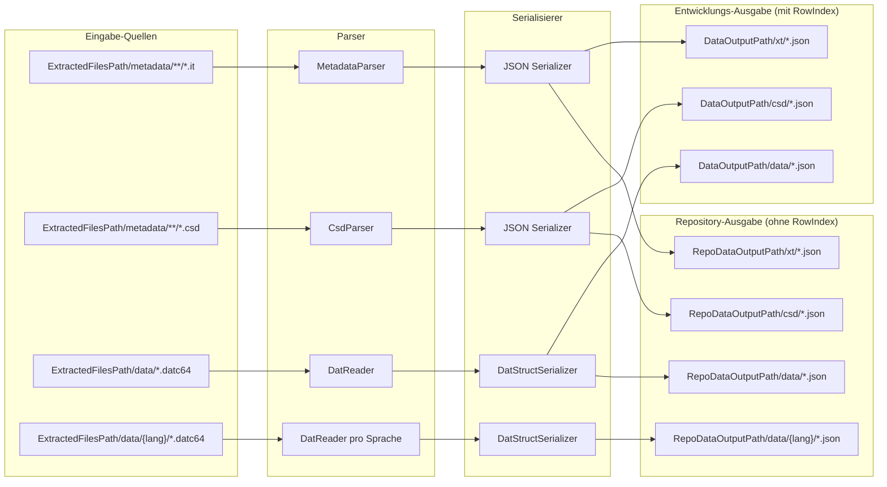

### Dateimengen (Beispiel)

Basierend auf dem Projekt-Status:

| Kategorie | Anzahl Eingabe-Dateien | Anzahl Ausgabe-Dateien |
|-----------|------------------------|------------------------|
| *.it Dateien | ~2.000+ (geschätzt) | ~2.000+ JSON |
| *.csd Dateien | ~10-20 (geschätzt) | ~10-20 JSON |
| *.datc64 (Haupt) | Unbekannt | Verarbeitet durch 814 Structs |
| *.datc64 (pro Sprache) | Unbekannt × 11 Sprachen | JSON pro Sprache |

### Wichtige Code-Stellen für Datei-Zugriff

| Operation | Datei | Zeile | Code |
|-----------|-------|-------|------|
| Metadata-Dateien finden | `src/Program.cs` | 36 | `Directory.GetFiles(Config.GetExtractedFilePath("metadata"), "*.it", SearchOption.AllDirectories)` |
| CSD-Dateien finden | `src/Program.cs` | 62 | `Directory.GetFiles(Config.GetExtractedFilePath("metadata"), "*.csd", SearchOption.AllDirectories)` |
| DATC64-Dateien finden | `src/Program.cs` | 96 | `Directory.GetFiles(dataFilesPath, "*.datc64", SearchOption.TopDirectoryOnly)` |
| Sprachen ermitteln | `src/Program.cs` | 24-25 | `Directory.GetDirectories(Path.Combine(Config.ExtractedFilesPath, "data"))` |
| Dateien lesen | `src/Program.cs` | 102 | `File.ReadAllBytes(file)` |

## 1. Dateiquellen und Input-Formate (Übersicht)

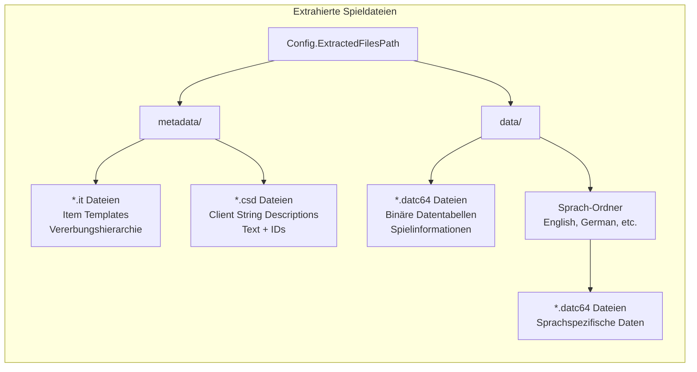

## 2. DATC64 Dateiformat-Struktur

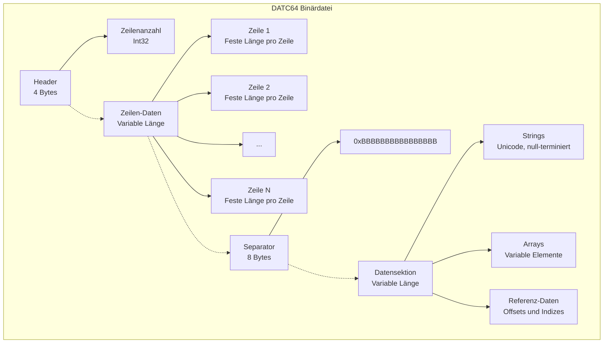

### Spezielle Werte

- **Null-Wert**: `0xFEFEFEFEFEFEFEFE` (8 Bytes)
- **Separator**: `0xBBBBBBBBBBBBBBBB` (8 Bytes)
- **String-Terminator**: `[0, 0, 0, 0]` (4 Bytes null) - Muss 2-Byte aligned relativ zum String-Start sein

## 3. DATC64 Verarbeitungs-Pipeline

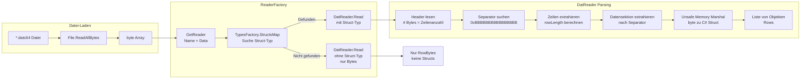

### Memory Marshalling Details

```csharp
// Unsafe Memory Marshal
var pointer = Unsafe.AsPointer(ref MemoryMarshal.GetReference(itemData));
var item = Marshal.PtrToStructure(new IntPtr(pointer), underlyingType);
```

## 4. Metadata (.it) Verarbeitung

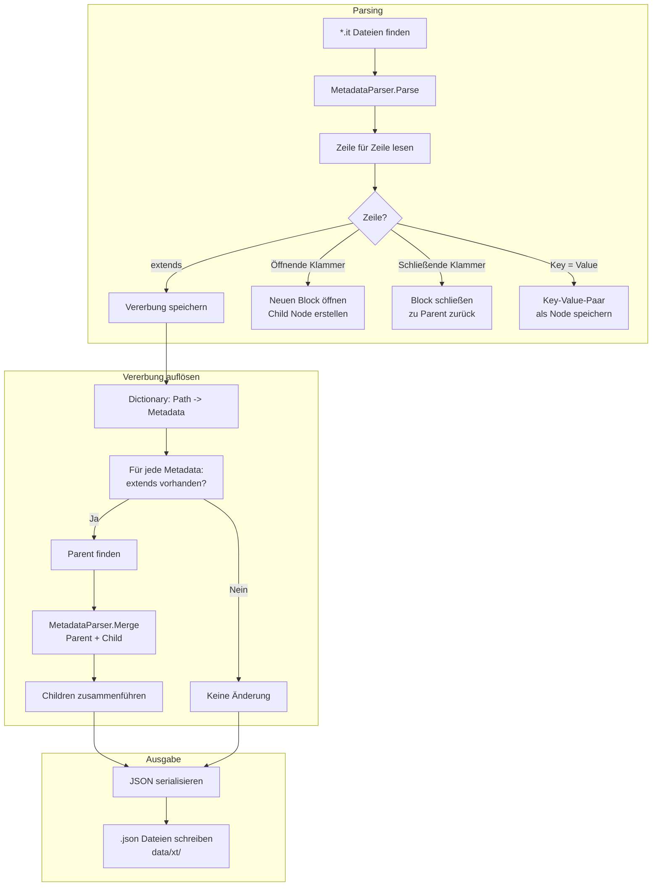

## 5. CSD (.csd) Verarbeitung

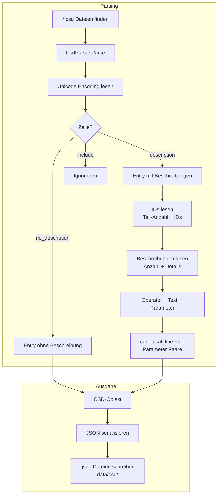

## 6. Serialisierungs-Prozess (DatStructSerializer)

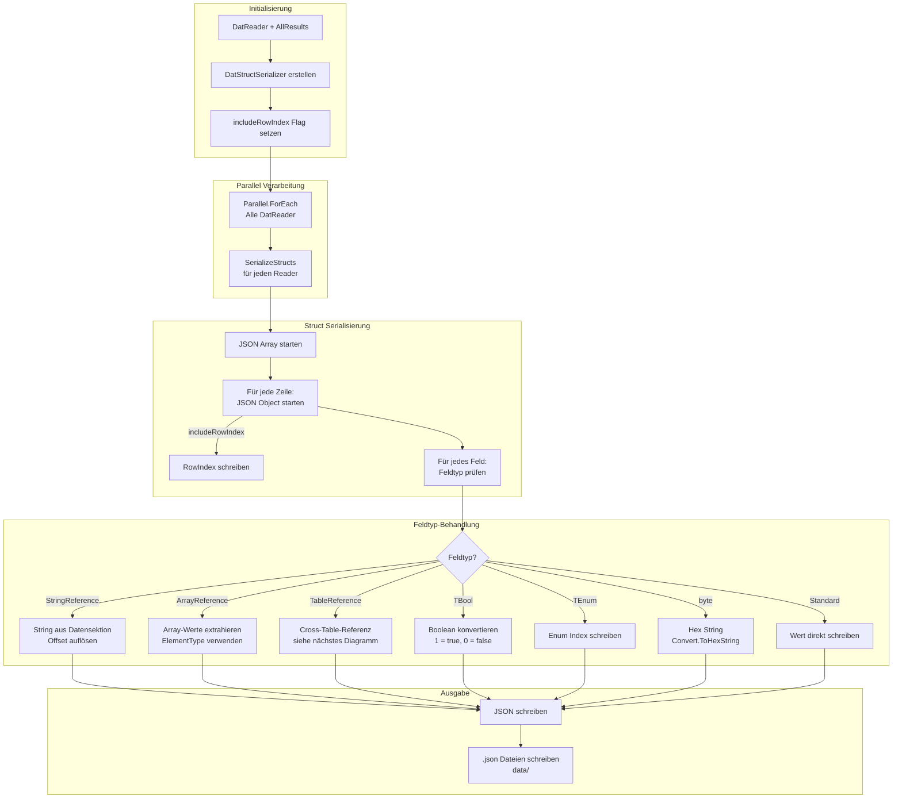

## 7. Referenz-Auflösung (Cross-Table References)

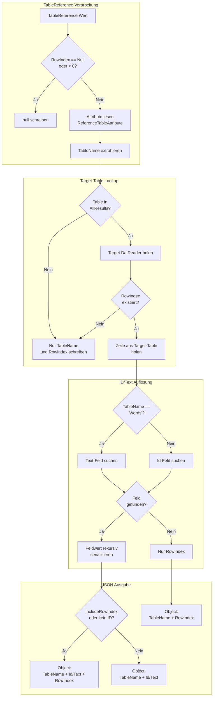

### Beispiel TableReference

```json
{
  "TableName": "Characters",
  "Id": "Warrior",
  "RowIndex": 0
}
```

Bei `includeRowIndex = false`:

```json
{
  "TableName": "Characters",
  "Id": "Warrior"
}
```

## 8. String-Referenz-Auflösung

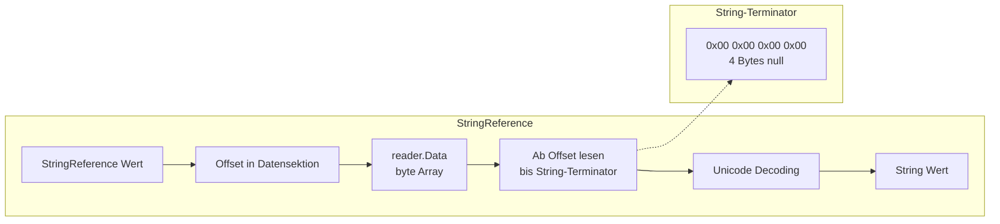

## 9. Array-Referenz-Auflösung

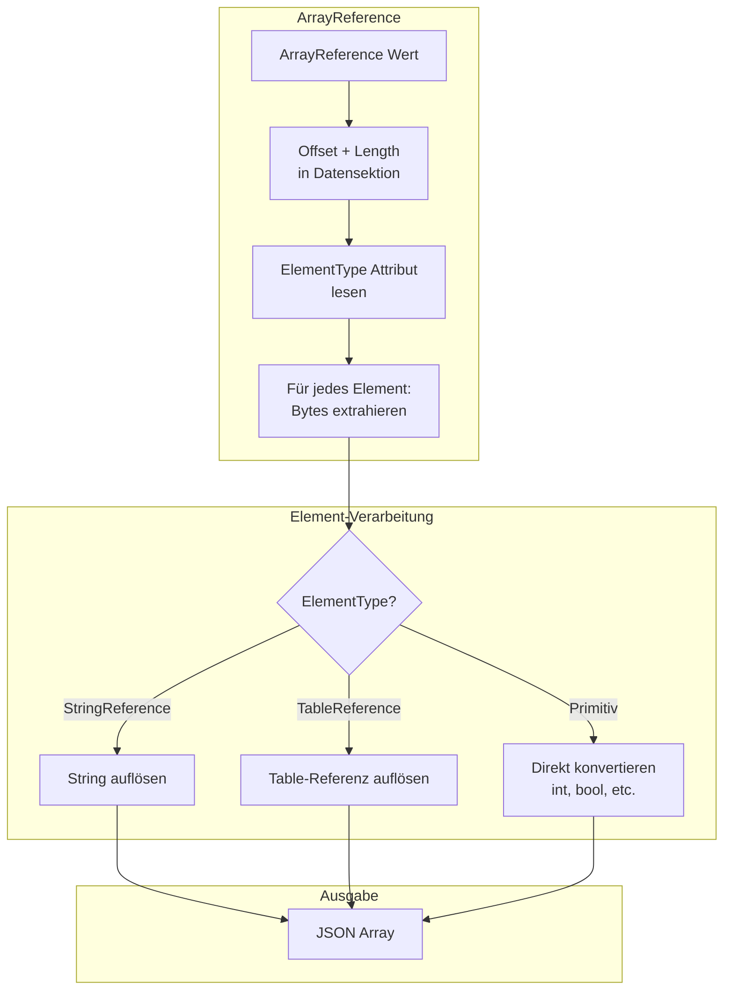

## 10. Output-Strukturen

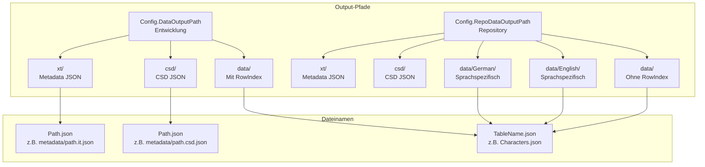

## 11. Generierte Strukturen (TypesFactory)

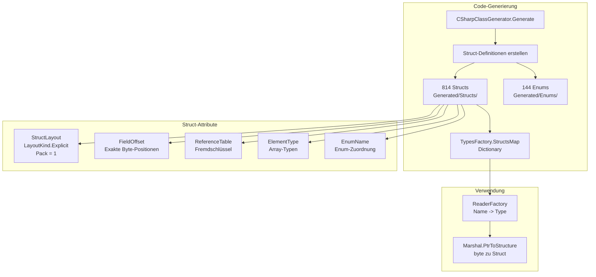

## 12. Parallele Verarbeitung

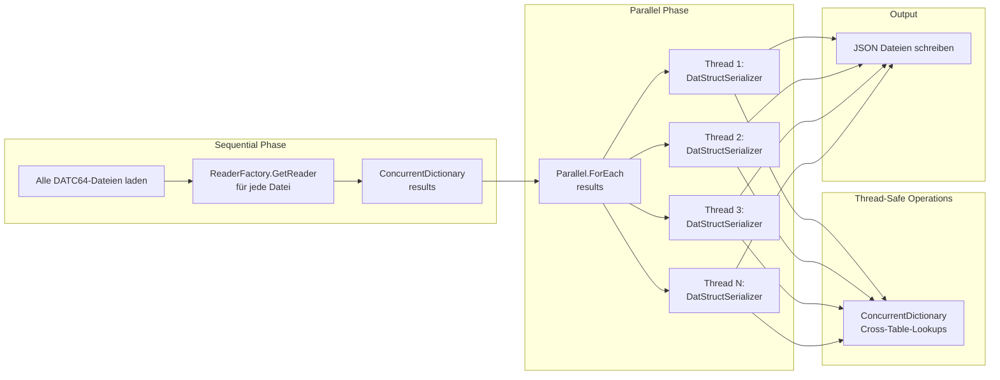

## Zusammenfassung: Kompletter Datenfluss

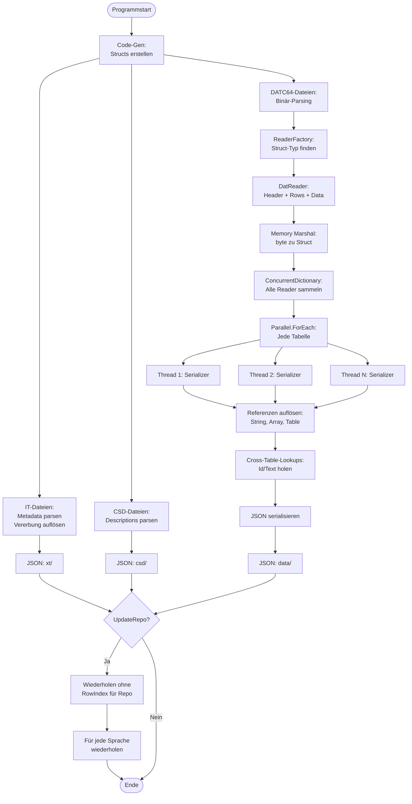

## Performance-Optimierungen

1. **Parallele Serialisierung**: `Parallel.ForEach` für alle Tabellen
2. **ConcurrentDictionary**: Thread-sichere Cross-Table-Lookups
3. **Memory Marshal**: Direkter Speicherzugriff ohne Kopieren
4. **Unsafe Code**: Pointer-basierte Konvertierung für maximale Performance

## Wichtige Code-Stellen

| Komponente | Datei | Zeilen |
|------------|-------|--------|
| Haupt-Workflow | `src/Program.cs` | 9-31 |
| DATC64 Parsing | `src/Parsers/DatReader.cs` | 16-53 |
| Serialisierung | `src/Serialization/DatStructSerializer.cs` | 27-90 |
| Referenz-Auflösung | `src/Serialization/DatStructSerializer.cs` | 92-174 |
| Metadata Parsing | `src/Parsers/MetadataParser.cs` | 30-95 |
| CSD Parsing | `src/Parsers/CsdParser.cs` | 34-121 |
| Type Factory | `src/Parsers/ReaderFactory.cs` | 7-18 |
